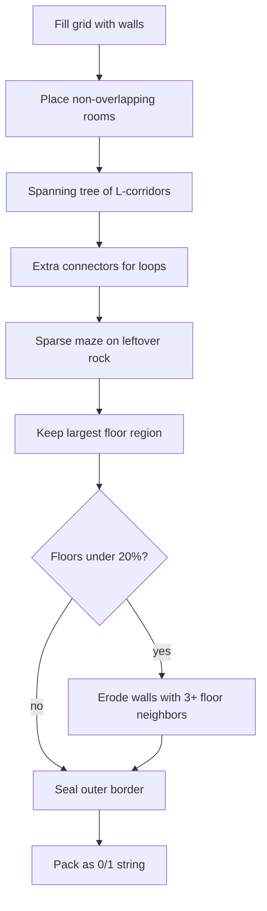
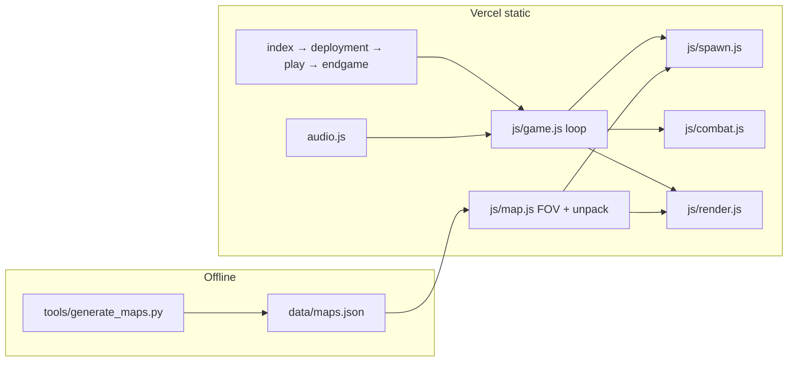

# KOMMANDO - Fog of War (Cavern Generation with Python)

A browser roguelite: real-time caverns, fog of war, sanity drain, extraction. A [Catastrophic Labs](https://catastrophiclabs.com/) game.

This repo is a **portfolio piece** for hiring managers and engineers. The craft on show is **offline procedural cavern generation** in Python; the browser only loads and plays the bank. No bundler, no backend, no accounts. Ships as static files on **Vercel**.


## Why maps are baked, not rolled in the browser

Runtime generation couples layout experiments to the game loop, fights the reload cycle, and is awkward to review in a PR. KOMMANDO splits the work:

| Layer | Owns | Does not own |
| --- | --- | --- |
| `tools/generate_maps.py` | Rooms, corridors, maze, connectivity, packing | Combat, HUD, audio |
| `data/maps.json` | 80 committed caverns (5 levels × 2 layouts × 8 seeds) | Anything at runtime except “pick one” |
| `js/map.js` | Unpack, FOV, fallback rectangle | Carving |
| `js/config.js` | Spawn budgets, palettes, cooldowns | Room counts |

Level **keys** and **grid sizes** must match between Python and JS. Carve parameters live only in Python.

## Loop

| Screen | File | Role |
| --- | --- | --- |
| Intro | `index.html` | Title sting |
| Briefing | `deployment.html` | Mission text |
| Mission | `play.html` | Audio unlock, then the run |
| Win | `endgame.html?outcome=extract` | Extraction screen |


**Win:** clear all five levels. On each level, collect every fragment so EXIT reads OPEN, then step on the pad. Levels 1-4 drop you into the next cavern (ammo carries). After Extraction (level 5), a short victory sting plays and the game opens `endgame.html`: typewriter log, ASCII panel, **[ RESTART LOOP ]** back to the intro. Enter or Space does the same.


**Lose:** sanity hits 0, a drone catches you, a mine finishes you, or the Extraction timer runs out. The canvas melts in place. You stay on `play.html`. **Descend again** retries from level 1; **Restart loop** returns to the intro. There is a collapse script on `endgame.html`, but death never navigates there.

**Objective:** fragments unlock the exit. Sanity drains over time. Drones chase if they see you. Palms hide you. Mines scramble controls. Ghosts (Paranoia) drain sanity on contact.

**Pickups and hazards** (same sprites as Help):

| Sprite | Color | What it does |
| --- | --- | --- |
| Fragment | Green diamond | Collect all to set EXIT OPEN |
| Exit | Steel door frame | Step on it once OPEN to extract / next level |
| Seed | Purple crystal | Restores sanity (drawn larger on the map) |
| Mine | Rust-red disc | Sanity hit + control scramble; not the gold ammo crate |
| Ammo | Gold crate | Restocks the magazine |
| Palm | Green | Camouflage from drones |

Help (`play.html`) lists each of those as its own row with a matching 20px pill. Sprites are fitted to the pill so palms are not cropped.


## Controls

| Action | Desktop | Mobile |
| --- | --- | --- |
| Move | WASD / arrows | Virtual stick |
| Fire | Space | FIRE |
| Pause | Esc | `[P]` |
| Mute | `[SND]` | `[SND]` |

On phones the status bar is **two rows** (mission + buttons, then sanity / FRAG / AMMO / EXIT) so labels do not overlap. Scrollbars use the same DOS green chrome as the HUD.

## Levels

Spawn counts are from `js/config.js`. The cavern itself is generated in Python.

| # | Key | Mission | Rooms | Connectors | Carve seeds | Enemies |
| --- | --- | --- | --- | --- | --- | --- |
| 1 | `reality` | Welcome Home | 10 | 3 | 1 | 1 |
| 2 | `jungle` | Flashback | 14 | 5 | 3 | 2 |
| 3 | `paranoia` | Targets of Opportunity | 15 | 5 | 3 | 3 |
| 4 | `psychosis` | The Raid | 16 | 6 | 4 | 4 |
| 5 | `collapse` | Extraction | 18 | 7 | 4 | 5 |

Later levels also place more fragments, mines, and ammo. Collapse starts a timed extract once the pad unlocks.

| Layout | Grid | When |
| --- | --- | --- |
| Landscape | 60×30 | Default |
| Portrait | 34×52 | Narrow phones, portrait |

## Map generator

`python tools/generate_maps.py` writes packed 0/1 grids. The browser never runs Python. Same seed → same cavern. `python tools/test_maps.py` is the check that matters (invariants, shipped bank, JS keys).

```bash
python tools/test_maps.py
python tools/generate_maps.py
python tools/generate_maps.py --preview --level jungle --layout landscape
```



### Why each stage exists

| Stage | Problem it solves |
| --- | --- |
| Rooms with a 1-tile gap | Chambers stay readable; two rects never fuse into a blob |
| Prim-style L-tunnels | Every room is reachable; corridors stay short |
| Extra connectors | Loops so the player and drones are not stuck on one spine |
| Sparse odd-grid maze | Eats leftover rock without turning the map into a perfect maze |
| Largest-region cull | Isolated pockets are unwinnable; they never ship |
| Neighbor erosion | Last-ditch open area: grows existing caves, no random holes |
| Sealed border | FOV and movement cannot walk off the grid |

Packed maps are `{ seed, w, h, cells }` with `cells` a length-`w*h` string of `'0'` / `'1'`. At runtime `pickCaveMap` chooses landscape vs portrait from the viewport, then a random variant. If `maps.json` fails to load, `CaveMap.fallback` carves a single open rectangle so the mission still boots.

<details>
<summary>ASCII preview: jungle, landscape, seed 1100 (<code>#</code> wall, <code>.</code> floor)</summary>

```
############################################################
############################################################
#########################...........########################
###.....................#...........#######.....############
###.#######.###########.#...........###########.####......##
###.....................#...........#########...####......##
###.................#####............########.######......##
###.....................#............########.....##......##
###................######............#........###.####.#####
###.............................................#.###.....##
###................######............#........#.#.###.....##
###................#########.###.###.#........#.#.###.....##
###................#########.###.###.#........#.#.###.....##
###................#######.......###.####.#####.#.###.....##
###................###...............####.##......#####.####
###.#######.##########.###..............#.##......#####.####
###########.##########.###..............#...............####
###########.##########.#########.........###............####
###########.##########.#########.........###.....######.####
###########.########......######.........#####..#.....#...##
#######...................######.#######.#####..#####.###.##
#######.......######......######.#######.####......##.....##
#######.......######......######.#####......#.............##
#######.......###############........#......#......#......##
#######.......###############.............................##
#######.......###############........#......########......##
#############################........#......########......##
#############################........#######################
############################################################
############################################################
```

</details>

Tune generation in `tools/generate_maps.py` (`LEVELS`, `LAYOUTS`). Re-run the CLI and commit `data/maps.json` in the same change.

## Audio

SFX are **recorded and designed in-house** with a Korg Minilogue, not stock packs. Files live under `audio/sfx/` (`shot`, `pickup`, `heal`, `mine`, `sanity_tick`, `levelup`). Loops and stings (`intro`, `deployment`, `background_loop`, `sanity_low`, `gameover`) sit in `audio/`.

`audio.js` (`KomAudio`) is a Web Audio engine: overlap-safe one-shots, loop fade, mute. If a file is missing, it falls back to a procedural tone so the run still has feedback. Footsteps are procedural unless a file list is configured.

Browsers block audio until a gesture; the descend gate on `play.html` is that unlock.

## Run locally

Static ES modules will not load from `file://`. From the repo root:

```bash
python -m http.server 8080
```

Open http://localhost:8080/

| Command | What it does |
| --- | --- |
| `python -m http.server 8080` | Serve the game |
| `python tools/test_maps.py` | Quick tests: generator, shipped bank, JS keys |
| `python tools/generate_maps.py` | Rebuild `data/maps.json` |
| `python tools/generate_maps.py --preview --level jungle` | ASCII cavern to stdout |
| `python tools/capture_screens.py 8080` | Refresh `screenshots/*.png` (server must already be running) |

This is a playable static demo, not a live service. No API, no secrets, no persistence beyond the current run.

## Tests

No extra Python packages. CI runs the same command (`.github/workflows/maps.yml`).

```bash
python tools/test_maps.py
```

About half a second. What it covers:

| Check | Fails when |
| --- | --- |
| Same seed twice | Generator is not deterministic |
| Different seeds | Layouts accidentally collide |
| Sealed border + one floor region | Unwinnable / off-map caverns |
| `data/maps.json` vs CLI | Bank is stale after a generator change |
| `js/config.js` keys and grid sizes | JS and Python drifted |
| Studio strings | Old branding still in HTML/README |

Re-run `python tools/generate_maps.py` and commit `data/maps.json` if the bank test fails.

## Architecture



| Path | Role |
| --- | --- |
| `tools/generate_maps.py` | Cavern CLI + `--preview` |
| `tools/test_maps.py` | Generator, bank freshness, JS key contract |
| `tools/capture_screens.py` | Playwright shots for README (`screenshots/*.png`) |
| `data/maps.json` | Shipped map bank |
| `js/map.js` | Unpack, FOV, fallback room |
| `js/game.js` | Loop, input, pause |
| `js/spawn.js` | Level setup, pickups, patrols |
| `js/combat.js` | Move, fire, drones, mines, melt |
| `js/render.js` | Cavern, sprites, HUD |
| `js/config.js` | Levels, palettes, cooldowns |
| `vercel.json` | Static deploy: no framework, keep `.html` URLs |
| `audio.js` / `audio/` | Engine + in-house SFX |

## Deploy

Static site. **No build step.** Vercel serves the repo root (`index.html` → `deployment.html` → `play.html` → `endgame.html`). `cleanUrls` is off so those `.html` links stay as-is.

Import the GitHub repo in the [Vercel dashboard](https://vercel.com/new) (framework: Other) or from the repo root:

```bash
npx vercel          # preview
npx vercel --prod   # production
```

No env vars. After changing room counts or grid sizes, regenerate maps and commit `data/maps.json` in the same change or the live bank will be stale. Point a domain (for example [catastrophiclabs.com](https://catastrophiclabs.com/)) at the Vercel project when you want a custom host.

## License

[MIT](./LICENSE). [Catastrophic Labs](https://catastrophiclabs.com/), 2026.
